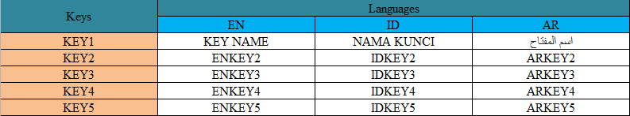
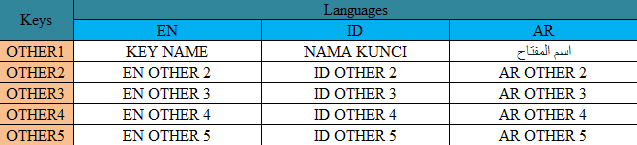

# Excel for Translation

## Installation

```bash
composer install
```

## Usage

> Note : Sheet name will be used as file name

Open [translation file](translation.xlsx)

**Inside translation file :**

Sheet name : *app*



Sheet name : *other*



```bash
php index.php
```

## Output

- language/
  - en
    - app.json
    - other.json
  - id
    - app.json
    - other.json
  - ar
    - app.json
    - other.json

**language/id/app.json** :

```json
{
  "KEY1": "NAMA KUNCI",
  "KEY2": "IDKEY2",
  "KEY3": "IDKEY3",
  "KEY4": "IDKEY4",
  "KEY5": "IDKEY5"
}
```

**language/ar/other.json** :

```json
{
  "OTHER1": "اسم المفتاح",
  "OTHER2": "AR OTHER 2",
  "OTHER3": "AR OTHER 3",
  "OTHER4": "AR OTHER 4",
  "OTHER5": "AR OTHER 5"
}
```

